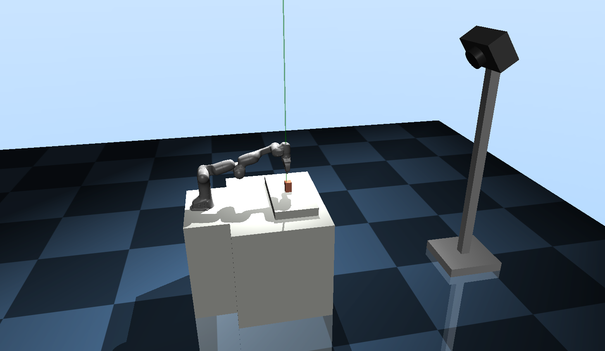

# Simple-MuJoCo-PickNPlace

## (2025-10-14) This repository's update is working in progress. Previous version is deprecated.


## How to run?
```
$ python pnp.py
```

## Detail
Rendering process is run on fixed camera. Environment picture below.


## Acknowlegement
Thanks to [sjchoi86](https://github.com/sjchoi86) for his brilliant MuJoCo environment setup and implementation